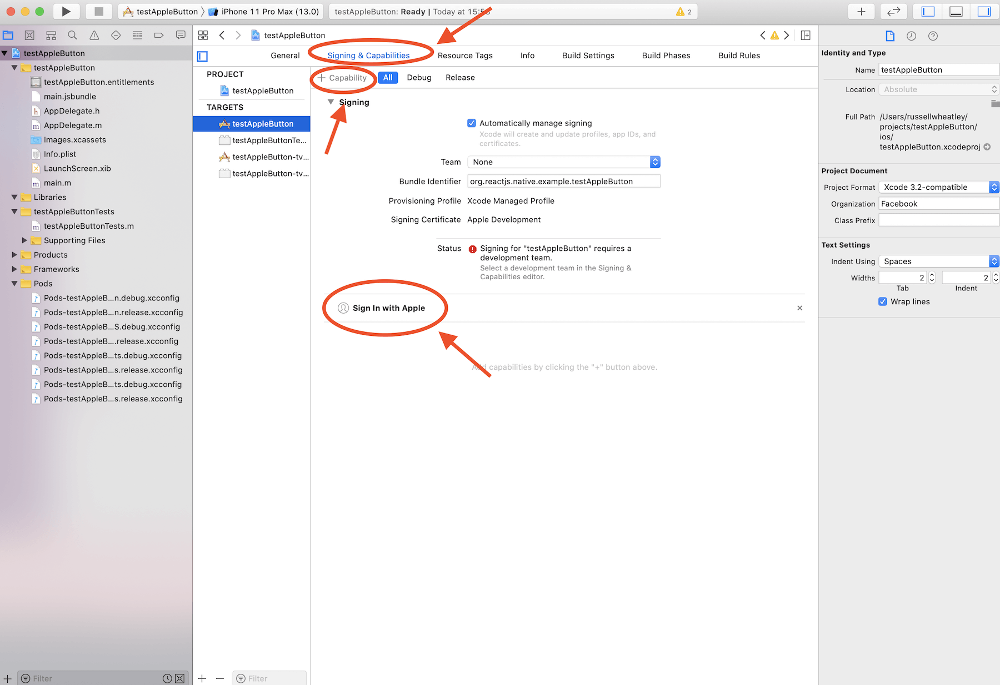
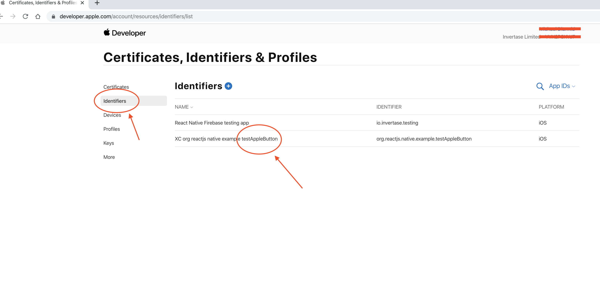

# Initial Development Environment Setup

## Instructions

For the purpose of demonstration, suppose we created a fresh React Native project called `testAppleButton`.

* Open your project in Xcode.

* Open the following file by navigating to this path: `testAppleButton/ios/testAppleButton.xcodeproj`

* Click `testAppleButton` under the target's header.

* Click `Signing and capabilities` to show the below noted view. Click `+ Capability` and from the menu select `Sign in with Apple` which will appear at the bottom as highlighted.

* You will need to sign as a team if you have this error message.

* If successful, your status should show no error message like below.

* Head over to [Apple's developer console](https://developer.apple.com/). Click `Account` in the nav bar at the top. You will either have to sign in, or create an account. Your account dashboard ought to look like this. If you do not see `Certificates, IDs & profiles` as an option in the left-hand sidebar, it means you have not yet enrolled in the [Apple developer program](https://developer.apple.com/programs/) which is a prerequisite for Apple product development.

* Click on `Identifiers` in the left-hand sidebar. Click on your project in the list, in our case, `testAppleButton`.

* Tick the checkbox for `Sign in with Apple` and click the `Edit` button. Select `Enable as a primary App ID` and click `Save` button.

* Click the `Save` button at the top of the screen.

* Please note: If you choose another app to be your primary app, you will have to through the above noted process, up until you naivgate to the Apple developer console, and choose the `Group with exisitng primary App ID` option & the `testAppleButton` ID.

