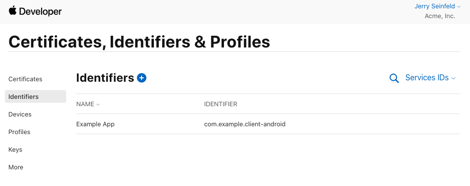
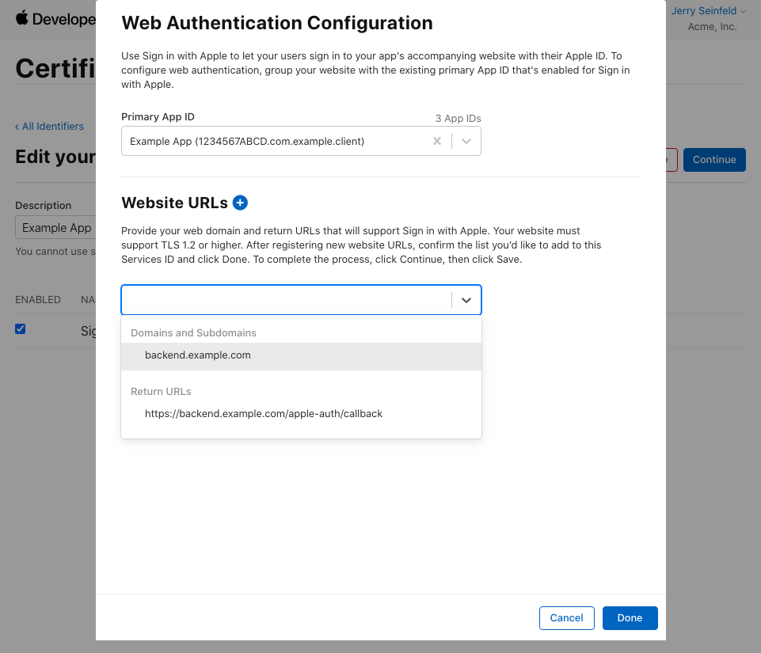

# Sign in with Apple for Android

## Services setup

To support Sign In with Apple on Android, we make use of Apple's [web setup](https://help.apple.com/developer-account/#/dev1c0e25352), but you'll need iOS configured as well.

When you're done with the web setup, you should have a Service ID that:
1. Is mapped to your domain
   - Must be the same domain that is in the return URL
2. Is using the App ID of your iOS app as it's primary
3. Includes the *exact* return URL you will provide to `appleAuthAndroid.configure`.

## Example

