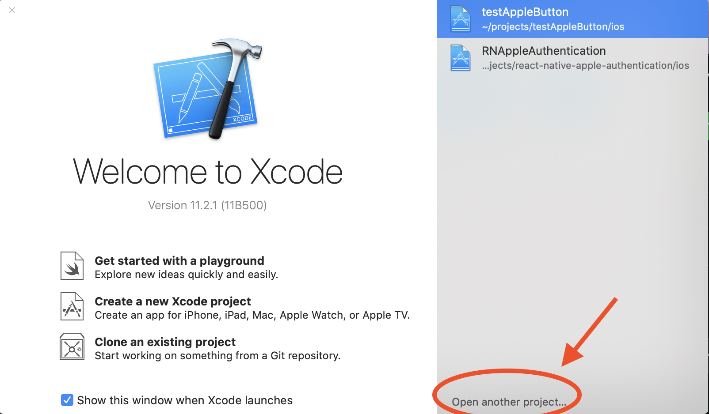
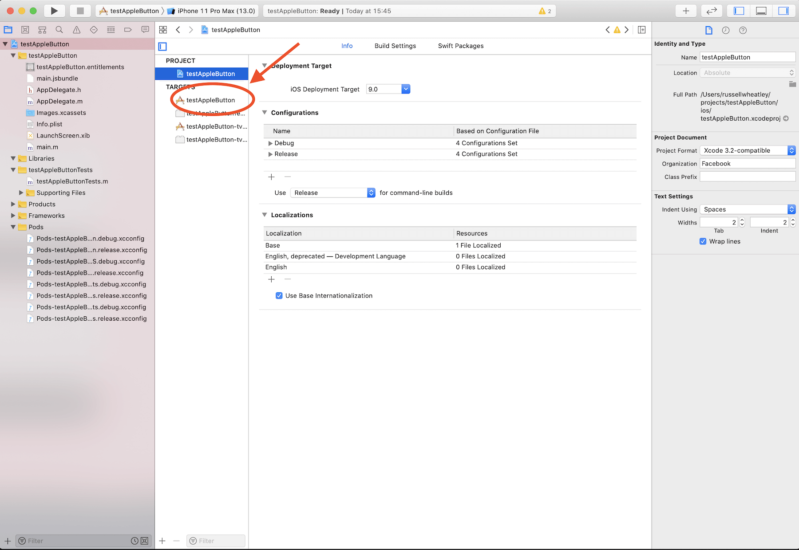
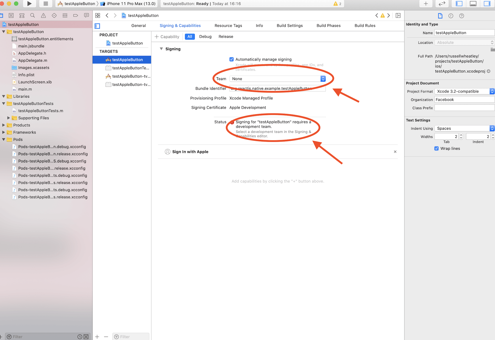
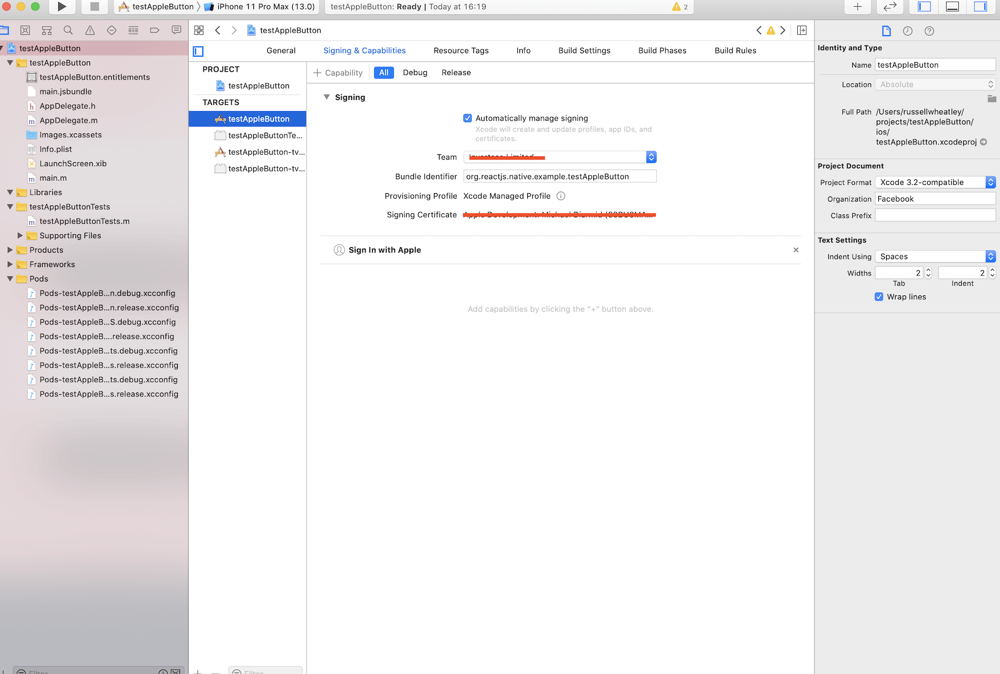
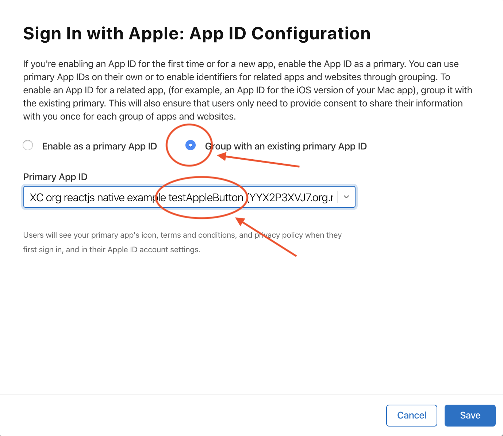
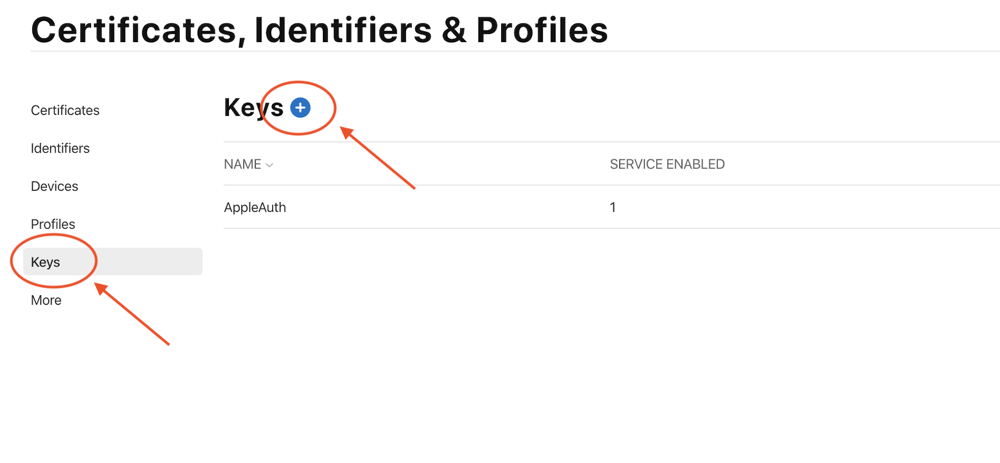
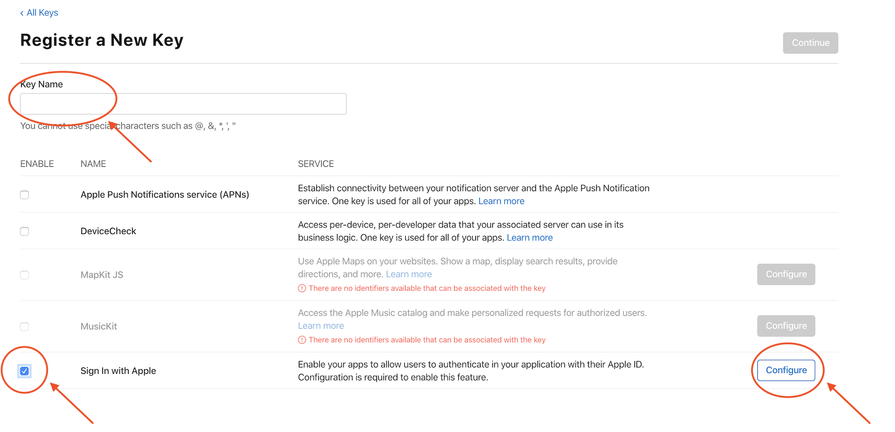
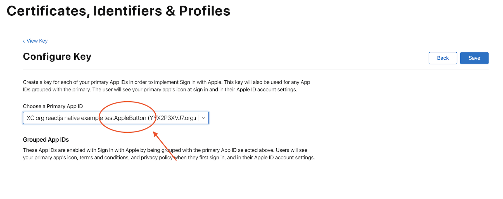
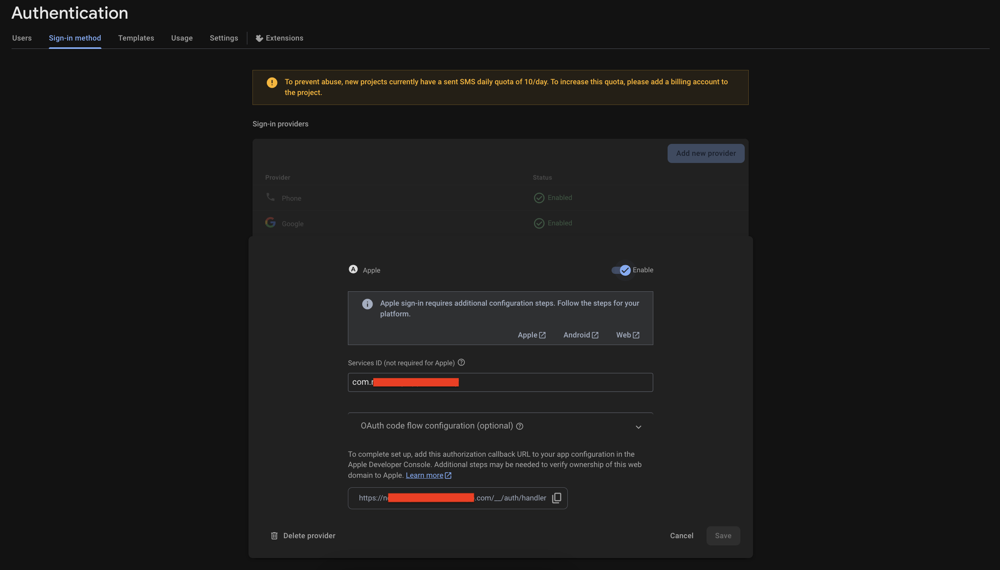

# Initial Development Environment Setup

## Instructions

For the purpose of demonstration, suppose we created a fresh React Native project called `testAppleButton`.

- Open your project in Xcode by clicking `open another project`, and navigating to this file: `testAppleButton/ios/testAppleButton.xcodeproj`

- Click `testAppleButton` under the target's header.

- Click `Signing and capabilities` to show the below noted view. Click `+ Capability` and from the menu select `Sign in with Apple` which will appear at the bottom as highlighted.

- You will need to sign in as a team if you have this error message.

- If successful, your status should show no error message like below.

- Head over to [Apple's developer console](https://developer.apple.com/). Click `Account` in the nav bar at the top. You will either have to sign in, or create an account. Your account dashboard ought to look like this. If you do not see `Certificates, IDs & profiles` as an option in the left-hand sidebar, it means you have not yet enrolled in the [Apple developer program](https://developer.apple.com/programs/) which is a prerequisite for Apple product development.

- Click on `Identifiers` in the left-hand sidebar. Click on your project in the list, in our case, `testAppleButton`.

- Tick the checkbox for `Sign in with Apple` and click the `Edit` button. Select `Enable as a primary App ID` and click `Save` button.

- Click the `Save` button at the top of the screen.

- Please note: If you choose another app to be your primary app, you will have to go through the above noted process, up until you navigate to the Apple developer console, and choose the `Group with existing primary App ID` option & the `testAppleButton` ID.

- Click on `keys` in left-hand sidebar and create a new key.

- Give your new key a name. Tick the checkbox next to `Sign In with Apple`, and click `Configure`.

- Select `testAppleButton` as our primary app ID.

- Register your key, download it and keep it secure. Initial setup is now complete.

### Firebase Setup

If you will use `@react-native-firebase/auth` for Social Login with Apple for Apple devices, you must add the Apple app's bundle id in the `Service ID` field in the Firebase Console

Example: Add `org.reactjs.native.example.testAppleButton` in the `Service ID` field

### If you're also enabling Android support, a few extra steps are necessary.

Check out [the guide](ANDROID_EXTRA.md) for more information.
